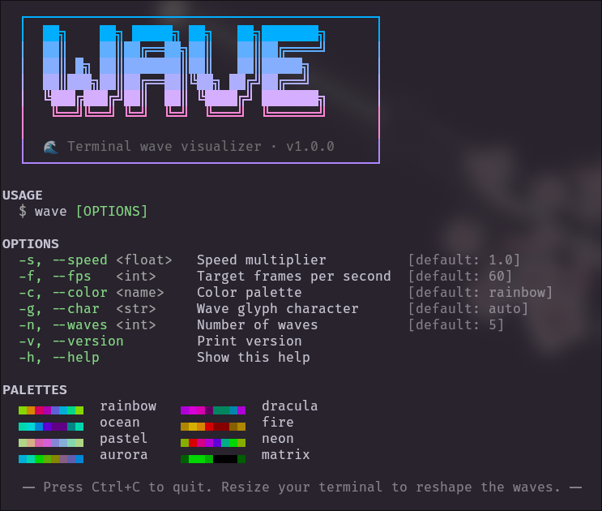
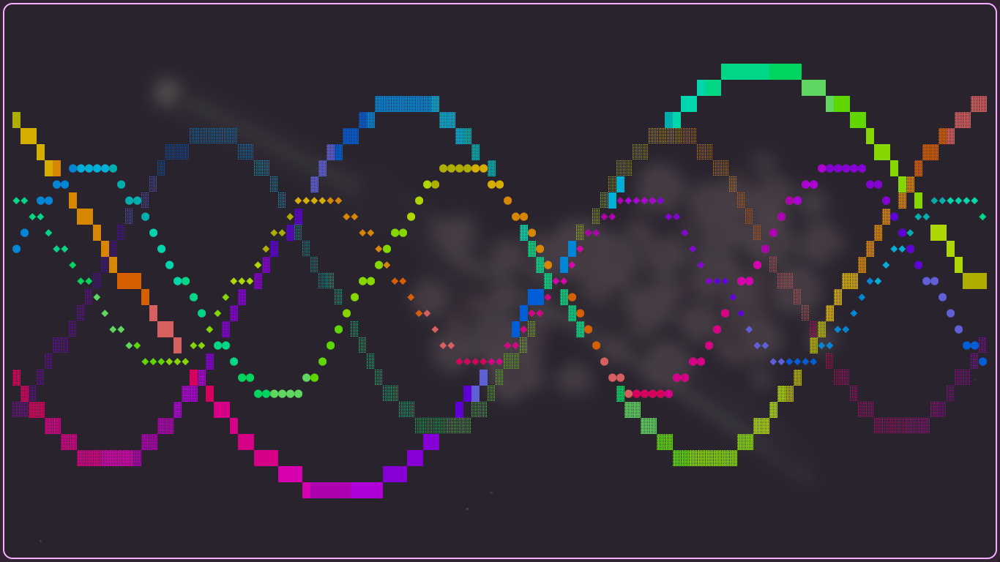

<h1 align="center">wave</h1>

<p align="center">
  A fast, GPU-free terminal wave visualizer written in pure C.<br>
  Double-buffered rendering · 8 color palettes · fully configurable via CLI.
</p>

<p align="center">
  <a href="#installation">Installation</a> · 
  <a href="#usage">Usage</a> · 
  <a href="#palettes">Palettes</a> · 
  <a href="#cli-reference">CLI Reference</a> · 
  <a href="#how-it-works">How It Works</a> · 
  <a href="#license">License</a>
</p>

<p align="center">
  
  
</p>

---

## Demo

https://github.com/user-attachments/assets/waveshowcase.mp4

> You can find the demo video locally at [`assets/waveshowcase.mp4`](assets/waveshowcase.mp4).

---

## Features

- **Double-buffered rendering** — Flicker-free output using a single `write()` call per frame.
- **8 built-in color palettes** — Rainbow, Dracula, Ocean, Fire, Pastel, Neon, Aurora, Matrix.
- **Dynamic terminal resizing** — Handles `SIGWINCH` to reshape waves on the fly.
- **Custom glyphs** — Override the default wave characters with any UTF-8 string.
- **Starfield background** — Subtle randomized dots fill empty space for added depth.
- **Graceful exit** — Catches `SIGINT`/`SIGTERM` to restore cursor and clean up memory.
- **Configurable speed, FPS, and wave count** — Tune the animation to your preference.
- **Zero dependencies** — Only requires a C99 compiler and `libm`.

---

## Installation

### Prerequisites

- GCC or any C99-compatible compiler
- `make`
- A terminal with 256-color support (most modern terminals)

### Build

```bash
git clone https://github.com/OpalAayan/wavecli.git
cd wavecli
make
```

This produces the `wave` binary in the project root.

### Install system-wide (optional)

```bash
sudo make install          # installs to /usr/local/bin
```

To change the install prefix:

```bash
sudo make install PREFIX=/usr
```

### Uninstall

```bash
sudo make uninstall
```

---

## Usage

```bash
./wave                     # run with defaults
./wave --color ocean       # use the ocean palette
./wave -s 2.0 -f 120      # double speed, 120 FPS
./wave --char "~" -n 8    # use '~' glyph with 8 waves
```

Press **Ctrl+C** to quit. Resize your terminal window to reshape the waves in real time.

---

## Palettes

| Palette    | Description                                |
|:-----------|:-------------------------------------------|
| `rainbow`  | Full spectrum color cycling (default)      |
| `dracula`  | Purple-tinted dark theme palette           |
| `ocean`    | Cool blue-green aquatic tones              |
| `fire`     | Warm red-orange gradient                   |
| `pastel`   | Soft muted tones                           |
| `neon`     | High-contrast bright electric colors       |
| `aurora`   | Green-blue northern lights                 |
| `matrix`   | Monochrome green                           |

Select a palette with the `--color` flag:

```bash
./wave --color dracula
```

---

## CLI Reference

```
USAGE
  $ wave [OPTIONS]

OPTIONS
  -s, --speed  <float>    Speed multiplier              [default: 1.0]
  -f, --fps    <int>      Target frames per second      [default: 60]
  -c, --color  <name>     Color palette                 [default: rainbow]
  -g, --char   <str>      Wave glyph character          [default: auto]
  -n, --waves  <int>      Number of waves (1–50)        [default: 5]
  -v, --version           Print version
  -h, --help              Show help with palette preview
```

### Examples

```bash
# Chill slow ocean waves
./wave --color ocean --speed 0.5 --waves 3

# Intense neon rave
./wave --color neon --speed 3.0 --fps 144 --waves 12

# Minimal matrix rain style
./wave --color matrix --char "." --waves 8

# Custom diamond glyphs
./wave --char "◆" --color aurora
```

---

## How It Works

```
┌─────────────┐     ┌──────────────┐     ┌────────────┐
│  CLI Parse  │───🢖 │  Wave Setup  │───🢖 〷 Main Loop 〷
│  (getopt)   │     │  (generate)  │     │  (render)  │
└─────────────┘     └──────────────┘     └────────────┘
                                                   ↯
                    ┌────────────────────────────┐ │
                    │        Per Frame           │ │
                    │  1. Check SIGWINCH resize  │ │
                    │  2. Clear cell buffer      │⤶
                    │  3. Plot sine waves        │
                    │  4. Apply palette colors   │
                    │  5. Render starfield       │
                    │  6. write() full frame     │
                    └────────────────────────────┘
```

**Key design decisions:**

- **Single-file architecture** — Everything lives in `wave.c` (~690 lines) for simplicity and portability.
- **No ncurses dependency** — Raw ANSI escape sequences keep the binary small and fast.
- **256-color cube mapping** — Colors are computed mathematically using sine-based palette functions mapped to the 6×6×6 color cube (indices 16–231).
- **XorShift RNG** — The starfield uses a fast inline PRNG to avoid the overhead of `rand()`.
- **Safe memory management** — All allocations go through `xmalloc`/`xcalloc`/`xrealloc` wrappers that abort on failure.

---

## Project Structure

```
wavecli/
├── wave.c          # Main source — all logic in one file
├── Makefile        # Build system (gcc, install targets)
├── LICENSE         # MIT License
├── README.md       # This file
└── assets/
    ├── wave.png          # Screenshot
    └── waveshowcase.mp4  # Demo video
```

---

## Makefile Targets

| Target      | Description                                        |
|:------------|:---------------------------------------------------|
| `make`      | Build optimized release binary                     |
| `make debug`| Build with AddressSanitizer + UBSan                | 
| `make install` | Install to `$PREFIX/bin` (default `/usr/local`) |
| `make uninstall` | Remove installed binary                       |
| `make clean`| Remove build artifacts                             |
| `make format`| Format source with `clang-format`                 |

---

## Requirements

| Requirement       | Details                                |
|:------------------|:---------------------------------------|
| Compiler          | GCC / Clang (C99 or later)             |
| OS                | Linux, macOS, any POSIX system         |
| Terminal          | 256-color support, UTF-8 capable       |
| Libraries         | `libm` (math library, linked via `-lm`)|

## License
<sub> MIT License — Copyright (c) 2026 **Aayan~** </sub>

---
<div align="center">

### 🎔 Made with love by [OpalAayan](mailto:YougurtMyFace@proton.me)


## Star History

[](https://www.star-history.com/#OpalAayan/wavecli&type=date&legend=top-left)

<p align="center"></p>

</div>
